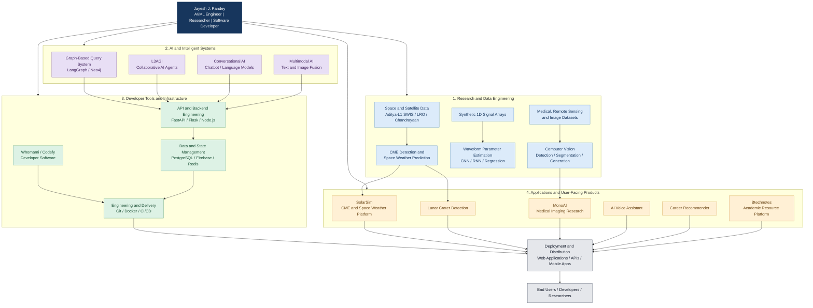
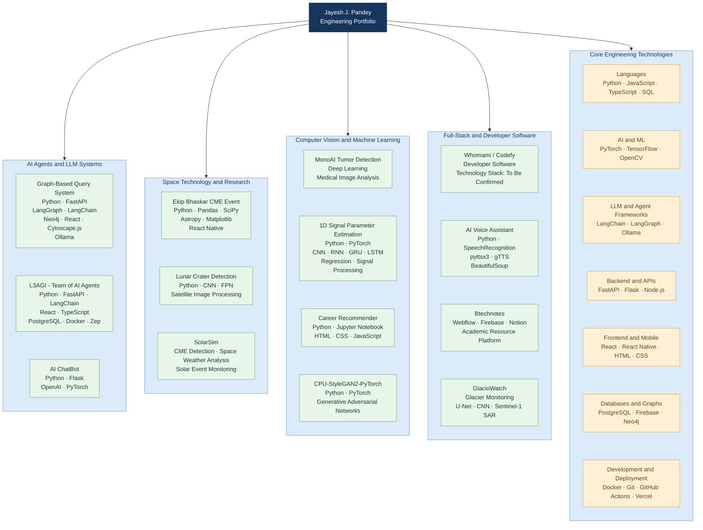
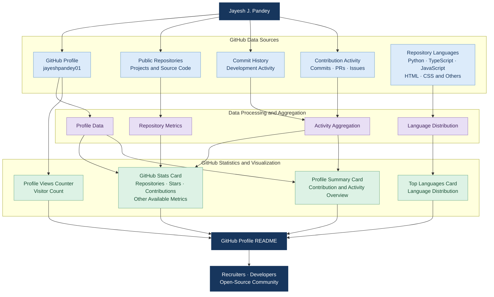

<h1 align="center">Hi, I'm Jayesh J. Pandey</h1>
<h3 align="center">Machine Learning Engineer | Space Technology Researcher | Full-Stack Developer | Hyper-Realistic Artist</h3>

<p align="center">
  
</p>

<p align="center">
  <a href="https://gitfut.com/jayeshpandey01">
    
  </a>
  <a href="https://github.com/jayeshpandey01">
    
  </a>
</p>

---

---
### Currently Working On

- **Whomami (Codefy)** — Developing software for software developers, with a focus on improving the developer experience.
- **AI Friends** — An intelligent social media companion built around a multi-agent system.
- **Lunar Crater Detection** — Developing computer vision models to identify and classify lunar craters in satellite imagery.
- **Tumor Detection with MonoAI** — Applying deep learning techniques to medical imaging for tumor detection.
- **Aditya-L1 CME Early Warning** — Developing AI-driven approaches for solar event analysis and space weather prediction.
- **[Btechnotes](https://msha.ke/btechnotes)** — An academic resource platform serving more than 100,000 users.
- **[QHBERT](https://github.com/jayeshpandey01/QHBERT)** — Classical fake-news detectors (BERT, RoBERTa, etc.) are accurate but expensive — 110M+ parameters, brittle to paraphrasing, and blind to the kind of subtle linguistic entanglement misinformation exploits. QHBERT replaces the final classification stage of a frozen DistilBERT encoder with a small variational quantum circuit, cutting trainable parameters by ~2200× while targeting competitive accuracy.

---

### Featured Projects



| Project | Description | Technology Stack | Links |
|---|---|---|---|
| **Graph-Based Query System** | A full-stack dashboard for querying Order-to-Cash business data. Builds a Neo4j knowledge graph from JSONL documents and supports natural-language queries through a LangGraph-based agent, with interactive Cytoscape visualizations. | Python, FastAPI, LangGraph, LangChain, Neo4j, React, Cytoscape.js, Ollama | [GitHub](https://github.com/jayeshpandey01/Graph-Based-Query-System) |
| **Ekip Bhaskar CME Event** | An AI-driven early-warning system for Halo Coronal Mass Ejections using ISRO's Aditya-L1 SWIS data. Reports 84% accuracy, with validation against the CACTUS database, kinematic modeling, and a React Native visualization interface. | Python, Pandas, SciPy, Astropy, Matplotlib, React Native | [GitHub](https://github.com/jayeshpandey01/Ekip_Bhaskar_CME_Event) |
| **L3AGI — Team of AI Agents** | An open-source framework for collaborative AI agents, featuring memory, tool integrations, data connectors, report generation, and a web-based interface. | Python, FastAPI, LangChain, React, TypeScript, PostgreSQL, Docker, Zep | [GitHub](https://github.com/jayeshpandey01/L3AGI---Team-of-AI-Agents) |
| **Career Recommender** | A data-driven career recommendation system that generates personalized career suggestions through a web-based interface. | Python, Jupyter Notebook, HTML, CSS, JavaScript | [GitHub](https://github.com/jayeshpandey01/Career_recommender) |
| **Lunar Crater Detection** | A computer vision project for detecting and labeling lunar craters in satellite imagery from LRO and Chandrayaan datasets. | Python, CNN, FPN, Satellite Image Processing | [GitHub](https://github.com/jayeshpandey01/MOON) |
| **AI Voice Assistant** | A multilingual Hindi-English voice assistant for system control, task automation, web scraping, and voice-based interaction. | Python, SpeechRecognition, pyttsx3, gTTS, BeautifulSoup | [GitHub](https://github.com/jayeshpandey01/voice-assistant) |
| **AI ChatBot** | A transformer-based conversational chatbot designed to support dynamic user interactions. | Python, Flask, OpenAI, PyTorch | [GitHub](https://github.com/jayeshpandey01/ChatBot-main) |
| **Btechnotes** | An academic resource-sharing platform providing study materials and educational resources to more than 100,000 B.Tech users. | Webflow, Firebase, Notion | [Website](https://msha.ke/btechnotes) |

**Achievement:** Global Winner, NASA Space Apps Challenge 2025, for SolarSim — an advanced CME detection and space weather platform.

---

### Connect With Me

<p align="left">
  <a href="https://twitter.com/pandey_jayesh_" target="_blank">
    
  </a>
  <a href="https://linkedin.com/in/pandey-jayesh" target="_blank">
    
  </a>
  <a href="https://kaggle.com/mickey2004" target="_blank">
    
  </a>
  <a href="https://instagram.com/pandey_jayesh_" target="_blank">
    
  </a>
  <a href="https://auth.geeksforgeeks.org/user/jayeshpas66y" target="_blank">
    
  </a>
</p>

---

### Skills and Tools

<p align="center">
  
</p>

<p align="center">
  <b>Programming:</b> Python, TypeScript, JavaScript, SQL |
  <b>AI/ML:</b> PyTorch, TensorFlow, LangChain, LangGraph, OpenCV |
  <b>Backend:</b> FastAPI, Flask, Node.js |
  <b>Frontend:</b> React, React Native |
  <b>Data and Infrastructure:</b> Neo4j, PostgreSQL, Firebase, Docker, Git, GitHub Actions
</p>

---

### GitHub Statistics




<div align="center">
  
  
</div>

---

### Beyond Engineering

- **Copy'S — Freelance Software Development:** Founded and operate Copy'S, delivering 30+ projects across web development, mobile applications, AI/ML, and business automation. Selected work includes [Joblet.ai](https://joblet.ai) and the [Copy'S portfolio](https://copys-client.vercel.app).

- **Automated Client Acquisition Engine:** Building an automated prospecting and outreach system that discovers potential clients through Google Maps, identifies relevant business opportunities, and sends personalized outreach emails through SMTP. The infrastructure combines Google Cloud Shell, VPS hosting, GitHub Actions, locally running LLMs, and Cloudflare services to support automated workflows and remote access.

- **WhoamI (Codefy) — Developer Security Platform:** Developing a desktop application and VS Code extension that identifies potential code vulnerabilities and provides actionable remediation suggestions. The system is designed around offline-first analysis and optional cloud processing through a self-managed VPS, with a privacy-focused approach that avoids storing source code or sending it to third-party AI providers. Cloud-processing behavior and data-retention guarantees depend on the final implementation and configuration.

```mermaid
flowchart TB
    ROOT["Jayesh J. Pandey<br/>Engineering and Product Portfolio"]

    ROOT --> COPYS
    ROOT --> AUTOMATION
    ROOT --> CODEFY

    subgraph COPYS["Copy'S - Software Development Business"]
        direction TB
        CLIENTS["Clients and Businesses"]
        REQUIREMENTS["Project Requirements"]
        DELIVERY["Websites · Mobile Apps<br/>AI/ML · Business Software"]
        PORTFOLIO["30+ Delivered Projects<br/>Selected Work: Joblet.ai"]

        CLIENTS --> REQUIREMENTS
        REQUIREMENTS --> DELIVERY
        DELIVERY --> PORTFOLIO
    end

    subgraph AUTOMATION["Automated Client Acquisition Engine"]
        direction TB
        DISCOVERY["Google Maps Business Discovery"]
        FILTER["Prospect Filtering<br/>Business Relevance"]
        LLM["Locally Hosted LLM<br/>Personalized Outreach Drafts"]
        REVIEW["Review and Approval"]
        SMTP["SMTP Email Delivery"]
        TRACKING["Outreach Tracking"]

        DISCOVERY --> FILTER
        FILTER --> LLM
        LLM --> REVIEW
        REVIEW --> SMTP
        SMTP --> TRACKING
    end

    subgraph INFRA["Automation Infrastructure"]
        direction TB
        GCP["Google Cloud Shell"]
        VPS["VPS Hosting"]
        ACTIONS["GitHub Actions<br/>Scheduled Workflows"]
        CLOUDFLARE["Cloudflare Services<br/>Remote Access and Routing"]

        GCP --> VPS
        ACTIONS --> VPS
        VPS --> CLOUDFLARE
    end

    AUTOMATION -. "Runs on" .-> INFRA
    TRACKING --> LEADS["Interested Prospects"]
    LEADS --> CLIENTS

    subgraph CODEFY["WhoamI (Codefy) - Developer Security"]
        direction TB
        DESKTOP["Desktop Application"]
        EXTENSION["VS Code Extension"]
        SOURCE["Local Codebase"]
        SCANNER["Code Vulnerability Analysis"]
        FINDINGS["Findings and Risk Identification"]
        FIXES["Remediation Suggestions"]

        DESKTOP --> SOURCE
        EXTENSION --> SOURCE
        SOURCE --> SCANNER
        SCANNER --> FINDINGS
        FINDINGS --> FIXES
    end

    subgraph PROCESSING["Codefy Processing Options"]
        direction TB
        LOCAL["Offline Local Analysis"]
        PRIVATE["Optional Private VPS Processing"]
        PRIVACY["Privacy Controls<br/>No Intended Source-Code Retention"]

        LOCAL --> PRIVACY
        PRIVATE --> PRIVACY
    end

    SCANNER --> LOCAL
    SCANNER -. "Optional cloud mode" .-> PRIVATE
    PRIVACY --> RESULTS["Developer Receives Results"]
    FIXES --> RESULTS

    classDef root fill:#17365D,color:#FFFFFF,stroke:#17365D
    classDef business fill:#DCEBFA,color:#17365D,stroke:#6A9BCB
    classDef automation fill:#E8DFF5,color:#42245D,stroke:#9675BC
    classDef infrastructure fill:#FFF0D5,color:#684313,stroke:#D6A451
    classDef security fill:#DDF2E5,color:#174D32,stroke:#69A985

    class ROOT root
    class CLIENTS,REQUIREMENTS,DELIVERY,PORTFOLIO business
    class DISCOVERY,FILTER,LLM,REVIEW,SMTP,TRACKING,LEADS automation
    class GCP,VPS,ACTIONS,CLOUDFLARE infrastructure
    class DESKTOP,EXTENSION,SOURCE,SCANNER,FINDINGS,FIXES,LOCAL,PRIVATE,PRIVACY,RESULTS security
'''
